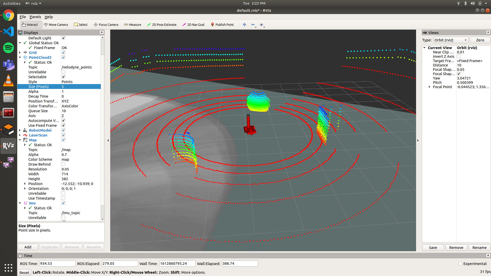

# Readme

## Gazebo

```
git clone https://github.com/teetangh/Qbotics-Labs-Internship-Differential-Drives --recursive

sudo apt install ros-melodic-teleop-twist-keyboard
sudo apt install ros-$ROS_DISTRO-cartographer*
```



## To Launch all the files

```
cd Qbotics-Labs-Internship-Differential-Drives/diff_drive_gazebo
rm -rf build/ devel/
catkin_make

if [ -n "$($SHELL -c 'echo $ZSH_VERSION')" ]; then
    echo "source Qbotics-Labs-Internship-Differential-Drives/diff_drive_gazebo/devel/setup.zsh" >>~/.zshrc
    source ~/.zshrc
elif [ -n "$($SHELL -c 'echo $BASH_VERSION')" ]; then
    echo "source Qbotics-Labs-Internship-Differential-Drives/diff_drive_gazebo/devel/setup.bash" >>~/.bashrc
    source ~/.bashrc
fi

roslaunch m2wr_worlds second_world.launch
roslaunch m2wr_description spawn.launch
rosrun teleop_twist_keyboard teleop_twist_keyboard.py
rosrun rqt_graph rqt_graph
roslaunch m2wr_cartographer diff_drive_cartographer_2d_demo.launch
```

## Webots

```
Use GUI
```
